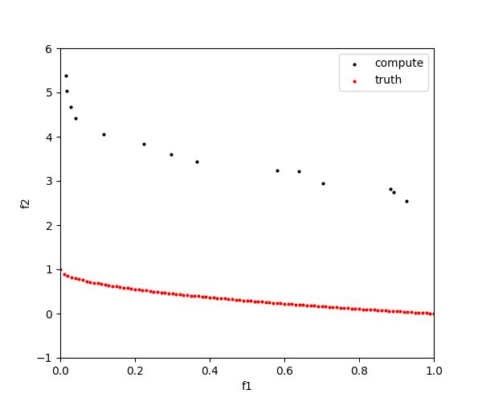
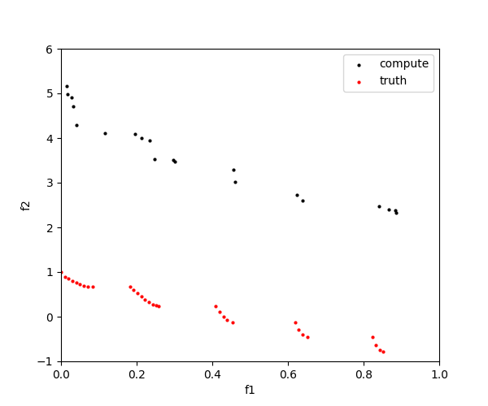

# nsga2
c++ implementation of NSGA2( non-dominated sorting genetic algorithm II)

# Compile
- cmake > 3.5
- g++ (Ubuntu 7.5.0-3ubuntu1~18.04)

```
mkdir build
cd build/
cmake ..
make
```

# Run & test
```
cd build/
mkdir front
./test_nsga2
```
Generated result data are saved under directory `build/front`.

# Results
Test on Zdt1 and Zdt3 problem, Results are shown below





# References
- Python: https://github.com/wreszelewski/nsga2
- c++: https://github.com/mushclam/NSGA2